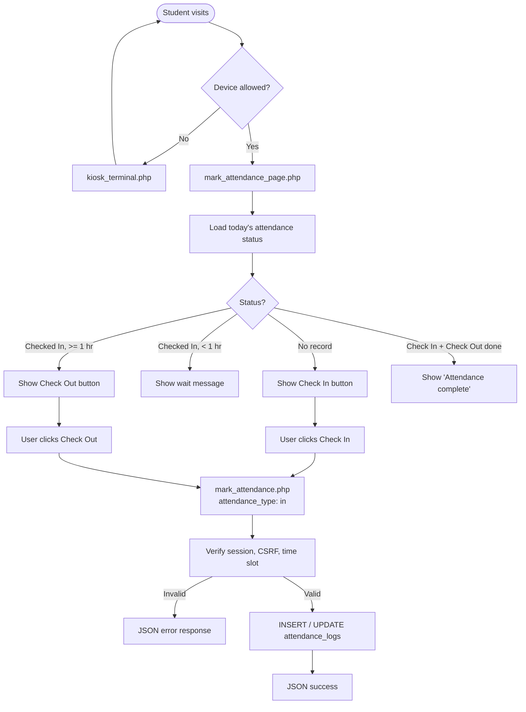
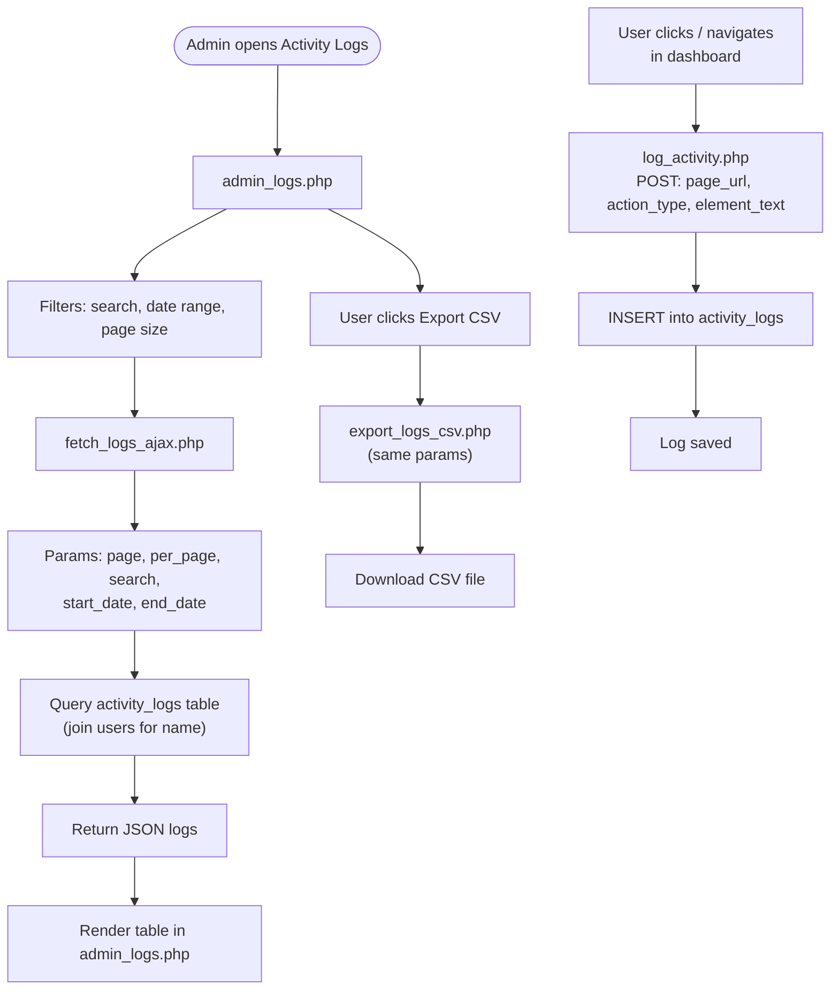
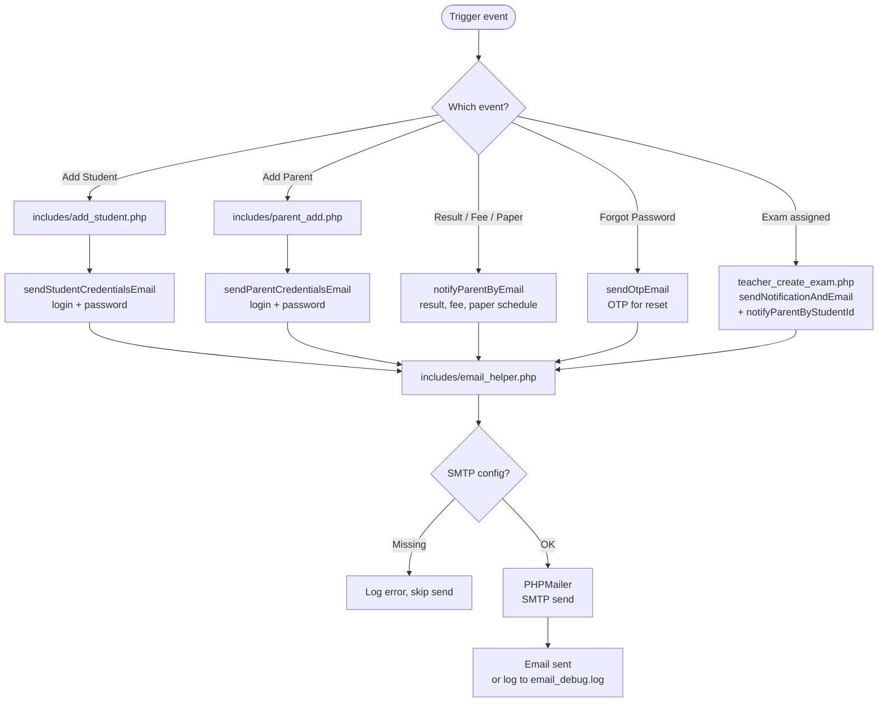

# Block Diagrams — Mark Attendance, Admin Logs, Exam, Email

Sab diagrams aapke diye format mein: `layout: fixed`, `flowchart TB`, `["text"]` / `{"?"}` / `-- label -->`.

---

## 1. Mark Attendance

---

## 2. Admin Logs

---

## 3. Exam (MCQ)

```mermaid
---
config:
  layout: fixed
---
flowchart TB
    Start(["User role?"]) --> Role{"Who?"}
    Role -- Admin/Teacher --> Create["teacher_create_exam.php"]
    Create --> Form["Select student, course, subject,\ntopic, difficulty, date/time"]
    Form --> Generate["Generate exam\nGemini API / questions"]
    Generate --> Save["Save exam_questions\n& student_exams"]
    Save --> Notify["Send notification + email\nto student & parent"]
    Notify --> ShowExams["show_exams.php"]
    Role -- Student --> Take["student_take_exam.php"]
    Take --> LoadExam["Load exam by exam_id"]
    LoadExam --> Attempt["Student answers questions"]
    Attempt --> Submit["Submit form to submit_exam.php"]
    Submit --> Validate["Validate CSRF, exam_id"]
    Validate --> Score["Compare answers, calculate marks"]
    Score --> Update["UPDATE student_exams\nINSERT exam_answers_log"]
    Update --> Redirect["Redirect to show_exams.php"]
    ShowExams --> ViewReport["view_student_result.php?exam_id"]
    ShowExams --> Delete["delete_exam.php\n(Admin/Teacher only)"]
    Delete --> Back["Redirect show_exams.php"]
```

---

## 4. Email

---

Yeh file **WORKFLOW_CHART.md** ke saath use kar sakte ho. Diagrams ko **Mermaid** support wale editor (VS Code + Mermaid extension, GitHub, mermaid.live) mein dekh sakte ho.
