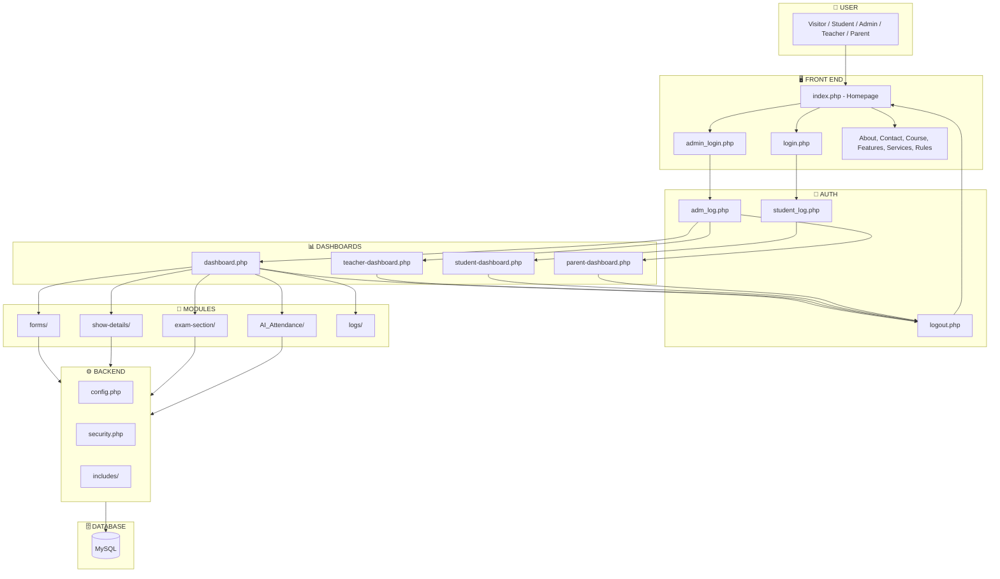
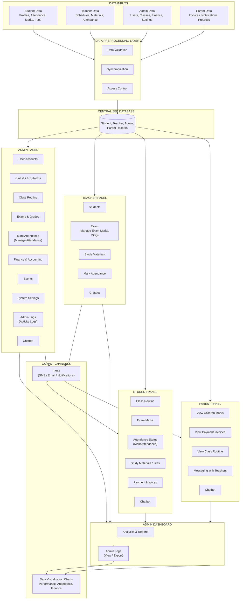
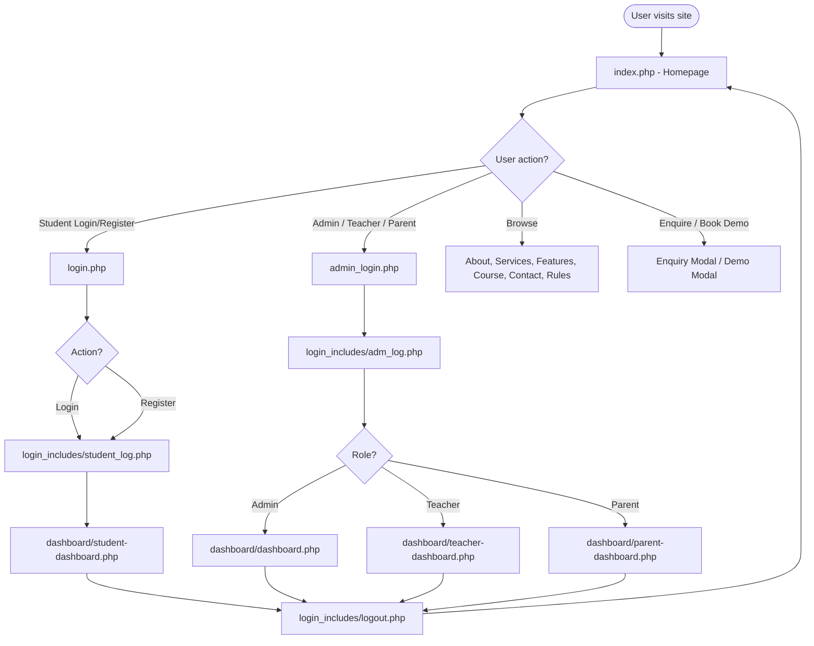
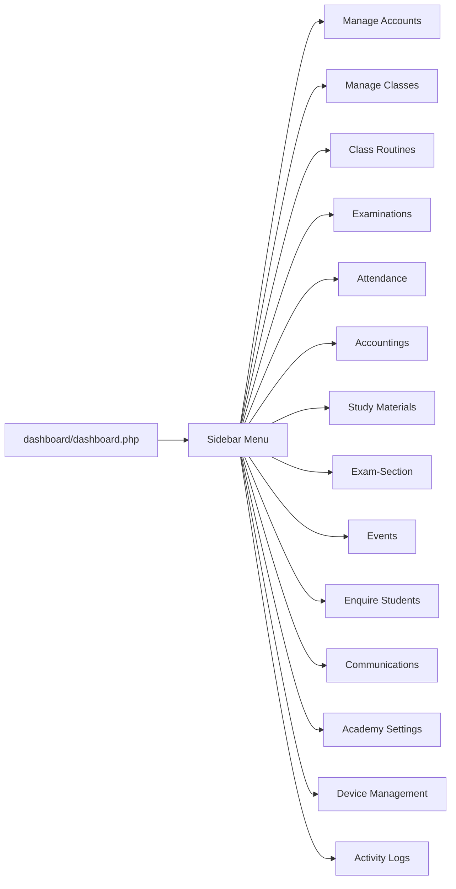
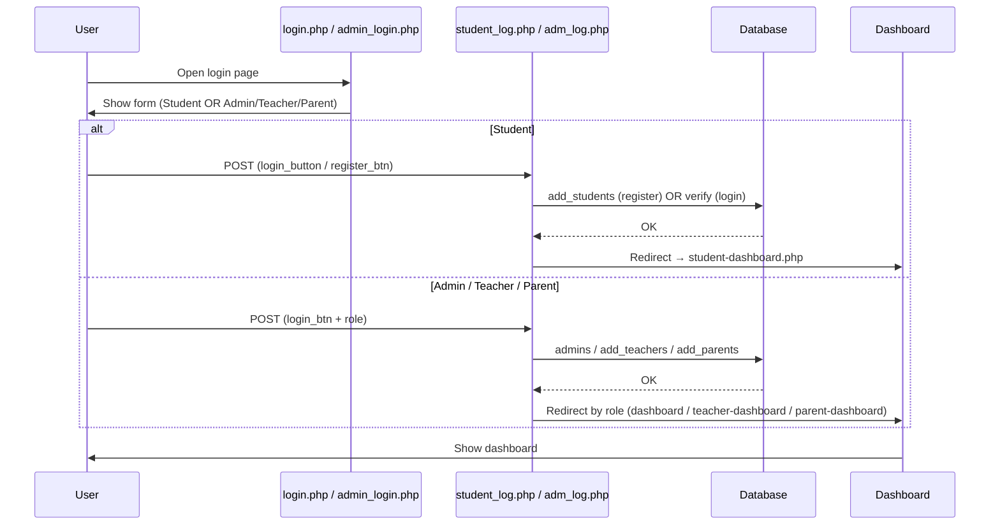
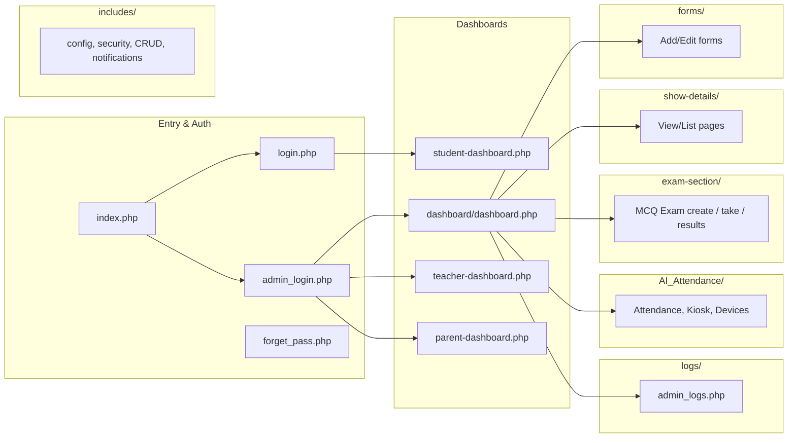

# Project Workflow Chart — Class Management System

Yeh document project ka **workflow** aur **block diagram** dikhata hai.

---

## Block Diagram (System Architecture)

Project ka high-level **block diagram** — kaunse blocks aapas mein kaise connect hain:

```mermaid
block-beta
    columns 3

    block:User["USER"]:2
        Visitor["Visitor"]
        Student["Student"]
        Admin["Admin/Teacher/Parent"]
    end

    block:Entry["ENTRY LAYER"]:2
        Index["index.php\n(Homepage)"]
        Pages["Pages\n(About, Contact, Course, etc.)"]
    end

    block:Auth["AUTHENTICATION"]:2
        Login["login.php\n(Student)"]
        AdminLogin["admin_login.php\n(Admin/Teacher/Parent)"]
        ForgetPass["forget_pass.php"]
        Logout["logout.php"]
    end

    block:Handlers["LOGIN HANDLERS"]:2
        StudentLog["student_log.php"]
        AdmLog["adm_log.php"]
    end

    block:Dashboards["DASHBOARDS"]:2
        AdminDash["dashboard.php\n(Admin)"]
        TeacherDash["teacher-dashboard.php"]
        StudentDash["student-dashboard.php"]
        ParentDash["parent-dashboard.php"]
    end

    block:AdminModules["ADMIN MODULES (iframe)"]:2
        Forms["forms/\n(Add/Edit)"]
        ShowDetails["show-details/\n(View/List)"]
        ExamSection["exam-section/\n(MCQ Exam)"]
        AIAttendance["AI_Attendance/\n(Attendance, Kiosk)"]
        Logs["logs/\n(Activity Logs)"]
    end

    block:Backend["BACKEND (includes/)"]:2
        Config["config.php"]
        Security["security.php"]
        CRUD["Add/Update handlers"]
        Notif["Notifications"]
    end

    block:Data["DATABASE"]:1
        DB[(MySQL\nTables)]
    end
```

**Simplified block diagram (flow view):**



**Block summary:**

| Block | Contents |
|-------|----------|
| **User** | Visitor, Student, Admin, Teacher, Parent |
| **Front End** | index.php, login.php, admin_login.php, static pages |
| **Auth** | student_log.php, adm_log.php, logout.php, forget_pass |
| **Dashboards** | Admin / Teacher / Student / Parent dashboards |
| **Modules** | forms/, show-details/, exam-section/, AI_Attendance/, logs/ |
| **Backend** | includes/ (config, security, CRUD, notifications) |
| **Database** | MySQL (add_students, add_teachers, admins, etc.) |

---

## Instacampus-Style Block Diagram (Modified)

Yeh diagram Instacampus-style layout follow karta hai, with **Mark Attendance**, **admin_logs**, **Exam**, aur **Email** explicitly add kiye gaye:



**Added / modified blocks in this diagram:**

| Feature | Where shown |
|--------|--------------|
| **Mark Attendance** | Admin Panel (Manage Attendance), Teacher Panel (Mark Attendance), Student Panel (Attendance Status) |
| **admin_logs** | Admin Panel (Admin Logs), Admin Dashboard (Admin Logs – View / Export) |
| **Exam** | Admin Panel (Exams & Grades), Teacher Panel (Exam – Manage Exam Marks, MCQ), Student Panel (Exam Marks) |
| **Email** | Output Channels – Email (SMS / Email / Notifications); feeds Parent & Student panels |

---

## 1. Overall Application Flow (Entry → Login → Dashboard)



---

## 2. Admin Dashboard — Sidebar Menu & Modules

Admin login ke baad **dashboard.php** open hota hai. Sidebar se har option par click karne par **iframe** mein corresponding page load hota hai (forms / show-details / exam-section / AI_Attendance / logs).



---

## 3. Admin Modules — Page Mapping (data-page → File)

Har sidebar item ka **data-page** value dashboard.js ke through **folder/filename.php** se map hota hai.

```mermaid
flowchart TB
    subgraph Manage_Accounts["Manage Accounts"]
        A1[teacher-add → forms/teacher-add.php]
        A2[show-teacher → show-details/show-teacher.php]
        A3[student-add → forms/student-add.php]
        A4[show-student → show-details/show-student.php]
        A5[parent-add → forms/parent-add.php]
        A6[show-parent → show-details/show-parent.php]
    end

    subgraph Manage_Classes["Manage Classes"]
        B1[class-add → forms/class-add.php]
        B2[show-class → show-details/show-class.php]
        B3[course-add → forms/course-add.php]
        B4[show-course → show-details/show-course.php]
    end

    subgraph Routines["Class Routines"]
        R1[time-table → forms/time-table.php]
        R2[show-timetd → show-details/show-timetd.php]
    end

    subgraph Examinations["Examinations"]
        E1[examinationform → forms/examinationform.php]
        E2[show-examinforms → show-details/show-examinforms.php]
        E3[admin-card → forms/admin-card.php]
        E4[show-admin-card → show-details/show-admin-card.php]
        E5[paper-time-table → forms/paper-time-table.php]
        E6[show-paper-sch → show-details/show-paper-sch.php]
    end

    subgraph Attendance["Attendance"]
        AT1[show-attendance → AI_Attendance/show-attendance.php]
    end

    subgraph Accountings["Accountings"]
        AC1[student-fee-det → forms/student-fee-det.php]
        AC2[show-std-fee → show-details/show-std-fee.php]
        AC3[result-add → forms/result-add.php]
        AC4[show-result → show-details/show-result.php]
    end

    subgraph Materials["Study Materials"]
        M1[study-mat-add → forms/study-mat-add.php]
        M2[show-study-mat → show-details/show-study-mat.php]
    end

    subgraph ExamSection["Exam-Section MCQ"]
        EX1[teacher_create_exam → exam-section/teacher_create_exam.php]
        EX2[show_exams → exam-section/show_exams.php]
    end

    subgraph Events["Events"]
        EV1[class-events-add → forms/class-events-add.php]
        EV2[show-cls-fun → show-details/show-cls-fun.php]
    end

    subgraph Enquire["Enquire Students"]
        EN1[show-online-student-details]
        EN2[show-demo-register-std-details]
        EN3[show-contact-student-details]
    end

    subgraph Communications["Communications"]
        C1[parent-meeting-form → forms/parent-meeting-form.php]
        C2[show-meets → show-details/show-meets.php]
    end

    subgraph Settings["Academy Settings"]
        S1[basic-info → forms/basic-info.php]
        S2[view-basic-info → forms/view-basic-info.php]
    end

    subgraph Devices["Device Management"]
        D1[admin_devices → AI_Attendance/admin_devices.php]
        D2[kiosk_share → AI_Attendance/kiosk_share.php]
    end

    subgraph Logs["Activity Logs"]
        L1[admin_logs → logs/admin_logs.php]
    end
```



---

## 4. Login Flow (Detail)



---

## 5. Folder Structure (High Level)



---

## Summary (Short)

| Step | Kya hota hai |
|------|----------------|
| 1 | User **index.php** (homepage) se aata hai |
| 2 | **Student** → login.php → student_log.php → student-dashboard |
| 3 | **Admin/Teacher/Parent** → admin_login.php → adm_log.php → role ke hisaab se respective dashboard |
| 4 | Admin dashboard se sidebar se koi bhi module → **iframe** mein forms / show-details / exam-section / AI_Attendance / logs ki PHP file load hoti hai |
| 5 | Logout → login_includes/logout.php → wapas login/home |

Is chart ko **GitHub**, **VS Code (Mermaid extension)**, ya **Mermaid Live Editor** (https://mermaid.live) mein paste karke diagram dekh sakte ho.
